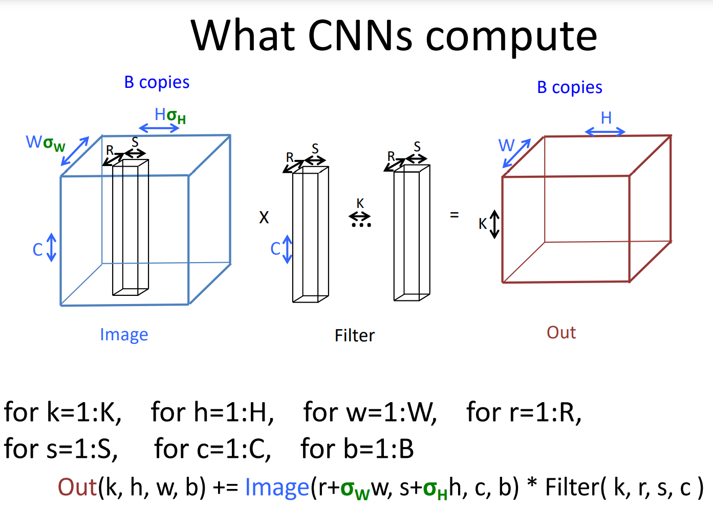

# CS267 Note

> Course Website: https://sites.google.com/lbl.gov/cs267-spr2021/pre-proposal

## P1: Introduction & Overview

Note:
1. load imbalance = inefficient
2. Simple parallel problem: : dividing big problem to many processors.
3. Classification of HPC:

    1. **SMP**: Shared Memory or Multicore
    2. **HPC**: High performance Computing or distribute memory
    3. **SIMD**: Single Instruction Multiple Data
4. Different between **Concurrency** & **Parallelism** : logical & actual
5. **Goal**: Exa-flop = 10^18 flop/s -GPU 
6. Top 500 Project

    1. Yardstick: Linpack -> Solve $Ax=b$
7. Performance history and Protection
8. **Gordon Bell Prize**: Application Performance 
9. **Five paradigm**: Theory & Experiment & Simulation & Data Analysis & Machine Learning
10. Analytics & Simulation
    - **7 Giants of Data:** Basic statics & Generalized N-Body & Graph-theory & Linear algebra & Optimizations & Integrations & Alignment
    - **7 Dwarfs of Simulation**:  Monte Carlo method & Particle methods & Unstructured meshes & Dense Linear Algebra & Sparse Linear Algebra &  Spectral methods &  Structured Meshes   
11. Limitation of HPC: 
    - Space limitation
	  - Single Chip : $r < c / 10^{12}$
	- **7 Giants of Data:** Basic statics & Generalized N-Body & Graph-theory & Linear algebra & Optimizations & Integrations & Alignment
	- **7 Dwarfs of Simulation**:  Monte Carlo method & Particle methods & Unstructured meshes & Dense Linear Algebra & Sparse Linear Algebra &  Spectral methods &  Structured Meshes.
12. Limitation of HPC: 
    - Space limitation: Single Chip: $r < c / 10^{12}$
    - Heat limitation: $Power \propto  V^2fC$
    - V-f 
13. Reinterpreted Moore's law

---

## P2: Memory Hierarchies and Matrix Multiplication

### Performance programming on uniprocessors requires 

- Understanding of memory system
  - Processor: variable, operation, control
  - Mem hierarchy: On chip cache > SRAM > DRAM > DISK >Cloud
    - Temporal & Spatial **locality**
  - Caches
  - Latency & Bandwidth

- Understanding of fine-grained parallelism in processor  
  - Pipeline 
  - **SIMD** & **FMA**

### Simple performance models can aid in understanding 

-  Two ratios are key to efficiency (relative to peak) 

1. **Computational intensity** of the algorithm:  
   - q = f/m = # floating point operations / # slow memory references 

2. **Machine balance** in the memory system:  
   - tm/tf = time for slow memory reference / time for floating point operation 

### Want $q > t_m/t_f$ to get half machine peak 

- Matrix Multiplication:
  - Naive: $q=f/m=2n^3/(n^3+3n^2) \approx  2$
  - Block: $q=f/m=2n^3/((2N+2)\times n^2)\approx n/N=b$


### Blocking (tiling) is a basic approach to increase q 

- Techniques apply generally, but the details (e.g., block size) are architecture dependent 
- Similar techniques are possible on other data structures and algorithms
- Optimize in Practice
  - Matrix Storage
  - Copy Optimization
  - Loop Unrolling
  - Removing False Dependency
  - Exploit Multiple registers
  - Minimize Pointer Updates


> **This is my understanding of the optimization of matrix multiplication later**:
>
> - Face a problem about Matrix multiplication in fast and slow memory.
> - First, defined the number of operations in fast and slow memory and computation intensity(CI) which is to evaluate the performance of algorithm. 
> - Then, simplified Matrix multiplication to Matrix-Vector multiplication, and analysis this problem to get the CI=2. 
> - After that, analysized Naive Matrix multiply and get the CI=2.
> - Due to Multiplication properties of partitioned matrices, she put forward Blocked(Tiled) Matrix multiply and get the CI=b(b*b is the size of partitioned matrices).
> - This small partitioned matrices can take advantage of **cache** in read and write, using SIMD in computation, thus get better performance.

---

## P3: Cache Oblivious MatMul and the Roofline Model

### Cache Oblivious MatMul

- Matrix matrix multiplication

  - Computational intensity O(2n^3) flops on O(3n^2) data 

- Tiling matrix multiplication (cache aware)

  - Can increase to b if b*b blocks fit in fast memory

  - b = sqrt(M/3), the fast memory size M

  - Tiling (aka blocking) “cache-aware”

  - **Cache-oblivious** - recursive

  - ```C
    Define C = RMM (A, B, n)
    if (n==1) { 
        C00 = A00 * B00 ; 
    } else{ 
        C00 = RMM (A00 , B00 , n/2) + RMM (A01 , B10 , n/2)
    	C01 = RMM (A00 , B01 , n/2) + RMM (A01 , B11 , n/2)
    	C10 = RMM (A10 , B00 , n/2) + RMM (A11 , B10 , n/2)
    	C11 = RMM (A10 , B01 , n/2) + RMM (A11 , B11 , n/2) 
    } 
    return C
    ```

  - $CI=f/m=2n^3/O(n^3/\sqrt{M})=O(\sqrt{M})$

  - **Don’t need to know M for this to work!**

- Optimized libraries (BLAS) exist

  - Flop/s:	MM(BLAS3) > MV(BLAS2)  ->  Compute Bound
  - Time:      MM(BLAS3) < MV(BLAS2)   -> Bandwidth Bound

​     


### Roofline Model

- Roofline captures upper bound **performance**

  - The min of 2 upper bounds for a machine
    - Peak flops (or other arith ops)
    - Memory bandwidth max
  - Algorithm computational intensity
    - Usually defined as best case, infinite cache
  - Machine balance： 
    - Balance = (Peak DP FLOP/s) / Peak Bandwidth
  - Computational / arithmetic intensity:  
    - CI = FLOPs Performed / Data Moved

- Originally for single processors and SPMs

  - | Operation | FLOPs        | Data     | CI          |
    | --------- | ------------ | -------- | ----------- |
    | Dot Prod  | $O(n)$       | $O(n)$   | $O(1)$      |
    | Mat Vec   | $O(n^2)$     | $O(n^2)$ | $O(1)$      |
    | MatMul    | $O(n^3)$     | $O(n^2)$ | $O(n)$      |
    | N-Body    | $O(n^2)$     | $O(n)$   | $O(n)$      |
    | FFT       | $O(n\log n)$ | $O(n)$   | $O(\log n)$ |

    

- Widely used in practice and adapted to any bandwidth/compute limit situation


---

## HW1 MM

### **MM - $3b^3<M$ + Block**

### **Z- morton** 

### **Cache-oblivious**


---

## P4: 

- Programming shared memory machines
  - May allocate data in large shared region without too many worries about 
    where
  - Memory hierarchy is critical to performance 
    - Even more so than on uniprocessors, due to coherence traffic
  - **For performance tuning, watch sharing (both true and false)**
- Semantics
  - Need to lock access to shared variable for read-modify-write
  - Sequential consistency is the natural semantics
    - Write race-free programs to get this
  - Architects worked hard to make this work
    - Caches are coherent with buses or directories
    - Cache:
      - write back: Update when evicted from cache
      - write through: Update always when wrote
    - No caching of remote data on shared address space machines
  - But compiler and processor may still get in the way
    - Non-blocking writes, read prefetching, code motion…
    - Avoid races or use machine-specific fences carefully


### Original Serial pi program with 100000000 steps

| threads | 1st SPMD | 1st SPMD padded | SPMD critical | PI Loop and reduction |
| ------- | -------- | --------------- | ------------- | --------------------- |
| 1       | 1.86     | 1.86            | 1.87          | 1.91                  |
| 2       | 1.03     | 1.01            | 1.00          | 1.02                  |
| 3       | 1.08     | 0.69            | 0.68          | 0.80                  |
| 4       | 0.97     | 0.53            | 0.53          | 0.68                 |

---

## P5  Sources of Parallelism and Locality I & II

### Outline

- Discrete event systems 
  - Time and space are discrete 
- Particle systems 
  - Important special case of lumped systems 
- Lumped systems (ODEs) 
  - Location/entities are discrete, time is continuous 
- Continuous systems (PDEs) 
  - Time and space are continuous 

### Summary of Discrete Event Simulations

**Approaches**

- Decompose domain, i.e., set of objects
- Run each component ahead using
  - **Synchronous**: communicate at end of each timestep
  - **Asynchronous**: communicate on-demand
    - Conservative scheduling wait for inputs 
      - need deadlock detection
    - Speculative scheduling assume no inputs 
      - roll back if necessary

### Summary of Particle Methods

- Model contains discrete entities, namely, particles
- Time is continuous must be discretized to solve
- Simulation follows particles through timesteps
  - `Force = external _force + nearby_force + far_field_force`
  - All-pairs algorithm is simple, but inefficient, O(n2)
  - Particle-mesh methods approximates by moving particles to a regular mesh, where it is easier to compute forces
  - Tree-based algorithms approximate by treating set of particles as a group, when far away
- May think of this as a special case of a lumped system

### Summary of ODE Methods

- **Explicit** methods for ODEs need <u>sparse-matrix-vector mult</u>.
- **Implicit** methods for ODEs need to <u>solve linear systems</u>
- Direct methods (Gaussian elimination)
  - Called LU Decomposition, because we factor A = L*U.
  - Future lectures will consider **both** **dense** and **sparse** cases.
  - More complicated than sparse-matrix vector multiplication.
- Iterative solvers
  - Will discuss several of these in future.
    - Jacobi, Successive over-relaxation (SOR) , Conjugate Gradient (CG), 
    - Multigrid,...
  - Most have sparse-matrix-vector multiplication in kernel.
- Eigenproblems
  - Future lectures will discuss dense and sparse cases.
  - Also depend on sparse-matrix-vector multiplication, direct methods.

### SpMV in Compressed Sparse Row (CSR) Format


- Pratitioning


### Goals of Reordering

- **Performance goals**
  - **balance load** (how is load measured?).
    - Approx equal number of nonzeros (not necessarily rows)
  - **balance storage** (how much does each processor store?).
    - Approx equal number of nonzeros
  - **minimize communication** (how much is communicated?).
    - Minimize nonzeros outside diagonal blocks
    - Related optimization criterion is to move nonzeros near diagonal
  - **improve register and cache re-use**
    - Group nonzeros in small vertical blocks so source (x) elements loaded into cache or registers may be reused (temporal locality)
    - Group nonzeros in small horizontal blocks so nearby source (x) elements in the cache may be used (spatial locality)
- Other algorithms reorder rows/columns for other reasons
  - Reduce # nonzeros in matrix after Gaussian elimination
  - Improve numerical stability


### Recap of Last Lecture

- 4 kinds of simulations
  - Discrete Event Systems
  - Particle Systems
  - Ordinary Differential Equations (ODEs)
  - Partial Differential Equations (PDEs) (today)
- Common problems:
  - **Load balancing**
    - May be due to lack of parallelism or poor work distribution
    - Statically, divide grid (or graph) into blocks
    - Dynamically, if load changes significantly during run
  - **Locality**
    - Partition into large chunks with low surface-to-volume ratio
    - To minimize communication
    - Distributed particles according to location, but use irregular spatial decomposition (e.g., quad tree) for load balance
  - **Constant tension between these two**
    - Particle-Mesh method: can’t balance particles (moving), balance mesh (fixed) and keep particles near mesh points without communication

### Summary of Approaches to Solving PDEs

- As with ODEs, either explicit or implicit approaches are possible
  - **Explicit**, sparse matrix-vector multiplication
  - **Implicit**, sparse matrix solve at each step
    - Direct solvers are hard (more on this later)
    - Iterative solves turn into sparse matrix-vector multiplication
      - Graph partitioning
- **Graph and sparse matrix correspondence:**
  - Sparse matrix-vector multiplication is **nearest** neighbor averaging on the underlying mesh
- Not all nearest neighbor computations have the same efficiency
  - Depends on the mesh structure (nonzero structure) and the number of Flops per point


### Summary sources of parallelism and locality

- Current attempts to categorize main kernels dominating simulation codes
- Seven Dwarfs (P. Colella)
  - **Structured grids** 
    - including locally structured grids, as in AMR
  - **Unstructured grids**
  - **Spectral methods** (Fast Fourier Transform)
  - Dense Linear Algebra
  - Sparse Linear Algebra
    - Both explicit (SpMV) and implicit (solving)
  - Particle Methods
  - Monte Carlo/Embarrassing Parallelism/Map Reduce (easy)


## P6  Communication-avoiding matrix multiplication

### Outline

- **Communication = moving data**
  - Between main memory and cache
  - Between processors over a network
  - Most expensive operation (in time or energy)
- Goal: **Provably minimize communication for algorithms that look like nested loops accessing arrays**
  - Includes matmul, linear algebra (dense and sparse), n-body, convolutional neural nets (CNNs), …
- Simple case: n-body (sequential, with main memory and cache) 
  - Communication lower bound and optimal algorithm
- Extension to Matmul
- Extension to algorithms that look like nested loops accessing arrays, like CNNs (and open questions)


### Data access for n-body

- `A()` = array of structures
  - ` A(i)` contains position, charge on particle `i`
- Usual n-body
  - `for i = 1:n, for j = 1:n except i, F(i) = F(i) + force(A(i),A(j))`
- Simplify to make counting easier
  - Let `B()` = array of disjoint set of particles
  - `for i = 1:n, for j = 1:n, e = e + potential(A(i),B(j))`
- Simplify more
  - `for i = 1:n, for j = 1:n, access A(i) and B(j)`


$$
\text{Transfer data:}\ n^2 \sim 2n\\
\text{Cache data:}\ M^2/4 \sim M
$$


### Generalizing to other algorithms

- Many algorithms look like nested loops accessing arrays
  - Linear Algebra (dense and sparse)
  - Grids (structured and unstructured)
  - Convolutional Neural Nets (CNNs) …
- Matmul: C = A*B
  - `for i=1:n, for j=1:n, for k=1:n`
    - `C(i,j) = C(i,j) + A(i,k) * B(k,j)`

### Proof of Communication Lower Bound on C = A·B (1/4)


- Thm (Loomis & Whitney, 1949) 

  - cubes in 3D set = Volume of 3D set ≤ (area(A shadow) · area(B shadow) · area(C shadow)) 1/2
  - $V\leq \sqrt{S_A \cdot S_B \cdot S_C}$ 

- \# loop iterations doable with `M` words of data = #cubes ≤ (area(A shadow) · area(B shadow) ·area(C shadow)) 1/2 ≤ (M · M · M) 1/2 = **M 3/2** = F 

- Need to read/write at least M n3/ F = Ω(n3/M 1/2) =  Ω(#loop iterations / M 1/2) words to/from cache

- $Cost=M\cdot n^3/ F = M\cdot n^3/ M^{3/2} = n^3/M^{1/2} $

  

### Parallel Case: apply reasoning to one processor out of P

- ”Fast memory” = local processor, “Slow memory” = other procs

- Goal: **lower bound # “reads/writes” = # words moved between** 

- one processor and others

- loop iterations = n3 / P (load balanced)

  - **M = 3n2 / P** (each processor gets equal fraction of data)

  - reads/writes  M · (n3 /P) / (M)3/2 = Ω (n2 / P1/2 )

  - $Cost=M\cdot (n^3/P)/ M^{3/2} = n^3/(P\cdot M^{1/2})  = n^2/ (\sqrt{3P}) \sim \Omega(n^2/p^{1/2})$ 

    





## P7  An Introduction to CUDA and GPUs

What’s in a CPU?


### Hardware Big Idea  

1. Remove components that  help a single instruction stream run fast 
   1. Discover parallelism 
   2. Consume energy
2. A larger number of  (smaller simpler) cores
3. Share the instruction stream
   1. SIMT: single instruction multiple threads
4. Masks
   1. 

### Running GPU Code (Kernel)

1. Allocate memory on GPU 
2. Copy data to GPU
3. Execute GPU program
4. Wait to complete 
5. Copy results back to CPU

```C++
float *x = new float[N];
float *y = new float[N];
//1. Allocate Memory on GPU
int size = N*sizeof(float);
float *d_x, *d_y; // device copies of x y 
cudaMalloc((void **)&d_x, size); 
cudaMalloc((void **)&d_y, size);
//2. Copy data to GPU
cudaMemcpy(d_x, x, size, cudaMemcpyHostToDevice); 
cudaMemcpy(d_y, y, size, cudaMemcpyHostToDevice);
//3. Run kernel on GPU
add<<<1,1>>>(N, d_x, d_y); 
//4. Wait to complete
//5. Copy result back to host 
cudaMemcpy(y, d_y, size, cudaMemcpyDeviceToHost); 

// Free memory 
cudaFree(d_x); cudaFree(d_y); 
delete [] x; delete [] y; 

// GPU function to add two vectors 
__global__
void add(int n, float *x, float *y) { 
    for (int i = 0; i < n; i++) 
    y[i] = x[i] + y[i]; 
} 

```


### Example: Vector Addition

```C++
// Run kernel on GPU
int blockSize = 256; 
int numBlocks = (N + blockSize - 1) / blockSize; 
add<<<numBlocks, blockSize>>>(N, x, y); 

// GPU function to add two vectors 
__global__
void add(int n, float *x, float *y) { 
    int index = blockDim.x * blockIdx.x + threadIdx.x;
    //Works for arbitrary N and # threads / block
    int stride = gridDim.x * blockDim.x;
    for (int i = index; i < n; i+=stride) 
    	y[i] = x[i] + y[i]; 
    }
} 
```


### Memory types on NVIDIA GPUs


- Shared Mem > Local Mem >> Global Mem

Hierarchical Parallelism Strategy

- Use both blocks and threads
- Limit on maximum number of threads/block 
  - Threads alone won’t work for large arrays 
- Fast shared memory only between threads 
  - Blocks alone are slower

Shared (within a block) Memory

- Declare using `__shared__`, allocated per block 
- Fast on-chip memory, user-managed 
- Not visible to threads in other blocks


### 1D Stencil Example

- `y[i] = x[i] + x[i-2] + x[i-1] + x[i+2] + x[i+1]`

- 

- Analyze

  - Input elements are read several times 
  - Reuse of inputs:

- Output

  - Divide output array into blocks, each assigned to a thread block
  - Each element within is assigned to a thread
  - Compute `blockDim.x` output elements
  - Write `blockDim.x` output elements to global memory

- Input

  - 
  - Cache (manually) input data in shared memory
  - Have each block read `(blockDim.x + 2 * radius)` input elements 
    from global memory to shared memory
  - Each block needs a halo of radius elements at each boundary
    - (halos are also called ghost regions)

- Code

  - ```C++
    __global__ void stencil_1d(int *in, int *out) {
        __shared__ int temp[BLOCK_SIZE + 2 * RADIUS];
        int gindex = threadIdx.x + blockIdx.x * blockDim.x;
        int lindex = threadIdx.x + RADIUS;
    
        // Read input elements into shared memory
        temp[lindex] = in[gindex];
        if (threadIdx.x < RADIUS) { // fill in halos
            temp[lindex - RADIUS] = in[gindex - RADIUS];
            temp[lindex + BLOCK_SIZE] = in[gindex + BLOCK_SIZE];
        }
        
        // Synchronize (ensure all the data is available)
    	__syncthreads();//Without this line, what will happened?
        
        // Apply the stencil
        int result = 0;
        for (int offset = -RADIUS ; offset <= RADIUS ; offset++)
        	result += temp[lindex + offset];
        // Store the result
        out[gindex] = result;
    }
    ```

- Problem: Race Condition 

  - Suppose thread 7 (of 8) reads the halo before thread 0 has filled it in
  - Synchronizes all threads within a block `void __syncthreads();`

#### Blocks must be independent

- Any possible interleaving of blocks should be **valid**
  - presumed to run to completion without pre-emption (not fairly scheduled)
  - can run in any order
  - can run concurrently OR sequentially
- Blocks may coordinate but not synchronize
  - shared queue pointer: **OK**
  - shared lock: **BAD** … can easily deadlock
- Independence requirement gives scalability

### Mapping CUDA to Nvidia GPUs

- Threads:
  - Each thread is a SIMD lane (ALU)
- Warps:
  - A warp executed as a logical SIMD instruction (sort of)
  - Warp width is 32 elements: LOGICAL SIMD width
  - (Warp-level programming also possible)
- Thread blocks:
  - Each thread block is scheduled onto an SM
  - Peak efficiency requires multiple thread blocks per processor
- Kernel
  - Executes on a GPU (there is also multi-GPU programming)

### Summary

- GPUs gain efficiency from simpler cores and more parallelism
  - Very wide SIMD (SIMT) for parallel arithmetic and latency-hiding
- Heterogeneous programming with manual offload
  - CPU to run OS, etc. GPU for compute
- Massive (mostly data) parallelism required
  - Not as strict as CPU-SIM (divergent addresses, instructions)
- Threads in block share faster memory and barriers
  - Blocks in kernel share slow device memory and atomics


---

## P8: Data Parallel Algorithms (aka, tricks with trees)

### The Power of Data Parallelism

- Data parallelism: perform the same operation on multiple  values (often array elements)
- Many parallel programming models use some data parallelism
  - SIMD units (and previously SIMD supercomputers) 
  - CUDA / GPUs
  - MapReduce
  - MPI collectives 

### Data Parallel Programming: Scans


- **Scan is always use for non-obvious algorithm**

### Ideal Cost Model for Data Parallelism

- Machine
  - An unbounded number of processors (p)
  - Control overhead is free
  - Communication is free
- Cost (complexity) on this abstract machine is the algorithm’s **span or depth**, T∞
  - Defines a lower bound on time on real machines\

### Broadcast and reduction on processor tree


- **$\log(n)$ is the lower bound!** 

### Multiplying n-by-n matrices in O(log n) time


- for $n^2$ parallel `c[i][j]` 
  - each tree depth = $\log(n)$
  - $O(\log n)$ 

### Can we parallelize a scan?

```c
y(0) = 0;
for i = 1:n
	y(i) = y(i-1) + x(i);
```

- Takes n-1 operations (adds) to do in serial
- The i th iteration of the loop depends completely on the (i-1) st iteration. 

### Sum Scan (aka prefix sum) in parallel


- Time for this algorithm on one processor (work)
  - $T_1(n) = n/2 + n/2 + T1 (n/2) = n + T1 (n/2) = 2n 1$
- Time on unbounded number of processors (span)
  - $T_{\infty}(n) = 2 \log n$

### Non-recursive exclusive scan


- This is both **work-efficient** (n adds) and  **space-efficient** (update in  place)

### Application: Stream Compression


- Remove matching elements
  - `int find (int x, int y) (y % x == 0) ? 1 : 0;`
  - `flags = apply(values, find)`

### Application: Radix Sort (serial algorithm)


- $n = [Bit_2, Bit_1, Bit_0]$


### List Ranking with Pointer Doubling


==?? Why  put a processor at every node==

```C
val = 1;
for(int i=0; i<log(n); i++){
	while (next != null){
        val += next.val
        next = next.next
	}
    __syncthreads();
}
```

### Application: Adding n-bit integers in O(log n) time


```C
c[-1] = 0;
for i = 0 to n-1
	c[i] = ( (a[i] xor b[i]) and c[i-1] ) or ( a[i] and b[i] )
```


### Lexical analysis


- Replace every character in the string with the array representation of its state-to-state function (column). 
- Perform a parallel-prefix operation with $\oplus$ as the array composition. Each character becomes an array **representing the state-to-state function for that prefix.** 
- Use initial state (N, row 1) to index into these arrays. 

### Inverting triangular n-by-n matrices


- Recursive !

### Mapping to GPUs

- For n-way parallelism may use n threads, divided into blocks 
- Merge across statements (so A=B; C=A; is a single kernel)
- Mapping threads to ALUs and blocks to SMs is compiler / hardware problem

### Bottom Line

- Branches are still **expensive** on GPUs
- May **pad** with zeros / nulls etc. to get length
- Often write code with a guard (if i < n), which will turn into mask fine if n is large
- Non-contiguous memory is supported, but will still have a higher cost
- Enough parallelism to keep ALUs busy and hide latency, memory/scheduling tradeoff

### Mapping Data Parallelism to SMPs (and MPPs)


$$
T_p(n) = O(n/p+\log p)
$$


### The myth of log n


### Summary of Data Parallelism

- Sequential semantics (or nearly) is very nice
  - Debugging is much easier without non-determinism
  - Correctness easier to reason about
- Cost model is independent of number of processors
  - How much inherent parallelism
- Need to “throttle” parallelism 
  - n >> p can be hard to map, especially with nesting
  - Memory use is a problem
- More reading
  - Classic paper by Hillis and Steele “Data Parallel Algorithms” 
  - https://doi.org/10.1145/7902.7903 and on Youtube
  - Blelloch the NESL languages and “NESL Revisited paper, 2006

